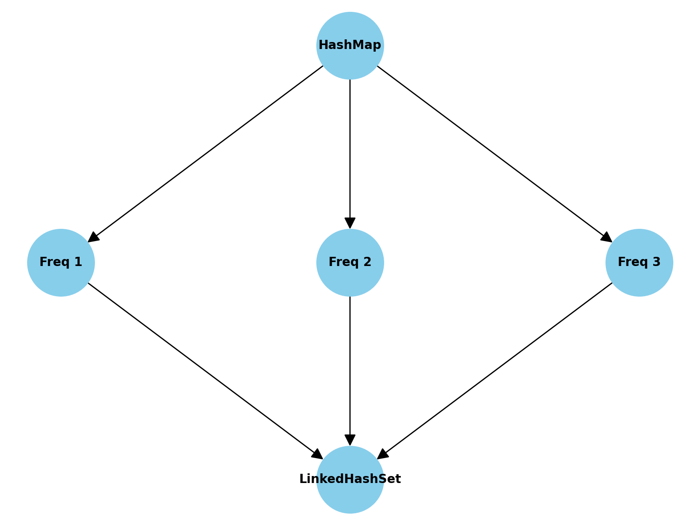

# LFU (Least Frequently Used) Cache Implementation in Java

## Code Snippet

```java
import java.util.*;

class LFUCache<K, V> {
    private final int capacity;
    private final Map<K, Node<K, V>> map;
    private final Map<Integer, LinkedHashSet<Node<K, V>>> freqMap;
    private int minFreq;

    public LFUCache(int capacity) {
        this.capacity = capacity;
        this.map = new HashMap<>();
        this.freqMap = new HashMap<>();
        this.minFreq = 0;
    }

    public V get(K key) {
        if (!map.containsKey(key)) {
            return null;
        }
        Node<K, V> node = map.get(key);
        updateFrequency(node);
        return node.value;
    }

    public void put(K key, V value) {
        if (capacity == 0) {
            return;
        }

        if (map.containsKey(key)) {
            Node<K, V> node = map.get(key);
            node.value = value;
            updateFrequency(node);
        } else {
            if (map.size() == capacity) {
                evict();
            }
            Node<K, V> newNode = new Node<>(key, value, 1);
            map.put(key, newNode);
            freqMap.computeIfAbsent(1, k -> new LinkedHashSet<>()).add(newNode);
            minFreq = 1;
        }
    }

    private void updateFrequency(Node<K, V> node) {
        int freq = node.freq;
        freqMap.get(freq).remove(node);

        if (freqMap.get(freq).isEmpty() && freq == minFreq) {
            minFreq++;
        }

        node.freq++;
        freqMap.computeIfAbsent(node.freq, k -> new LinkedHashSet<>()).add(node);
    }

    private void evict() {
        LinkedHashSet<Node<K, V>> nodes = freqMap.get(minFreq);
        Node<K, V> toRemove = nodes.iterator().next();
        nodes.remove(toRemove);

        if (nodes.isEmpty()) {
            freqMap.remove(minFreq);
        }
        map.remove(toRemove.key);
    }

    private static class Node<K, V> {
        K key;
        V value;
        int freq;

        Node(K key, V value, int freq) {
            this.key = key;
            this.value = value;
            this.freq = freq;
        }
    }
}
```

## Explanation

1. **Data Structures Used**:
   - **HashMap (K, Node)**: Maps keys to their corresponding nodes for O(1) access.
   - **Frequency Map (freq -> LinkedHashSet<Node>)**: Maps frequency counts to nodes with that frequency, allowing quick updates when frequency changes.

2. **Operations**:
   - **get(K key)**:
     - Retrieves the value of the key if it exists, updating its frequency.
   - **put(K key, V value)**:
     - Adds a new key-value pair to the cache. If the cache is full, the least frequently used key is evicted.

3. **Time Complexity**:
   - **Insertion**: O(1)
   - **Deletion**: O(1)
   - **Lookup**: O(1)

4. **Trade-Offs**:
   - **Memory Overhead**: Additional memory is required for frequency tracking and managing the HashMap and LinkedHashSet.
   - **Complexity vs. Performance**: While LFU is efficient, its implementation is more complex compared to simpler caching strategies like LRU.

5. **Applications**:
   - **Database Caching**: Retaining frequently queried data.
   - **Web Content Delivery**: Serving frequently accessed content faster.
   - **Memory Management**: Managing resources in constrained environments.

## Diagram



## Advantages

- Optimized for frequently accessed data.
- Ensures high performance for applications with predictable access patterns.

## Disadvantages

- Higher memory overhead.
- Implementation complexity compared to simpler strategies.

